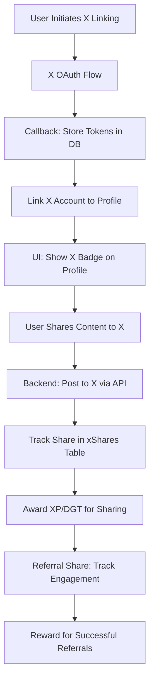

# DegenTalk X Integration Plan
*Date: 2025-06-15*

---

## Objective
Enable users to:
- Link their DegenTalk profiles to X accounts for seamless content sharing.
- Create DegenTalk accounts using X OAuth authentication.
- Share posts, threads, and DegenTalk material directly to X from our app.
- Leverage X integration for viral growth through the referral system and DegenTalk economy.

## Scope
- **Authentication**: Implement X OAuth 2.0 for account creation and linking.
- **Profile Linking**: Store X account data and tokens in user profiles.
- **Content Sharing**: Enable sharing of posts, threads, and referral links to X.
- **Economy Integration**: Reward users with XP or DGT for X-based activities (e.g., sharing, referrals).
- **Scalability**: Design for high user volume and API rate limits.
- **Viral Mechanics**: Integrate with referral system to incentivize X-based invites and content sharing.

## Dependencies
- **X Developer Account**: Obtain API keys and OAuth credentials for X API access.
- **OAuth Library**: Use a library like `passport.js` with `passport-twitter` strategy or a similar OAuth 2.0 client for X.
- **Database**: Update user schema to store X account data and tokens.
- **Frontend**: UI components for linking, authentication, and sharing.
- **Backend**: Services for handling X API calls and token management.
- **Economy System**: Existing XP and DGT systems for rewards.

## Implementation Steps

### 1. Database Schema Updates
- **Table: users (Extend Existing)**
  - Add fields for X integration:
    - `xAccountId`: `varchar('x_account_id', { length: 255 })` - Store X user ID.
    - `xAccessToken`: `varchar('x_access_token', { length: 512 })` - Store OAuth access token.
    - `xRefreshToken`: `varchar('x_refresh_token', { length: 512 })` - Store OAuth refresh token.
    - `xTokenExpiresAt`: `timestamp('x_token_expires_at')` - Token expiration time.
    - `xLinkedAt`: `timestamp('x_linked_at')` - Timestamp of linking.
  - Migration script: Create `migrations/0010_add_x_account_fields.sql` to add these columns.
- **Table: xShares (New Table for Tracking Shares)**
  - Track sharing activities for analytics and rewards:
    - `id`: `serial('id').primaryKey()`
    - `userId`: `integer('user_id').references(() => users.id, { onDelete: 'cascade' })`
    - `contentType`: `varchar('content_type', { length: 50 })` - e.g., 'post', 'thread', 'referral'.
    - `contentId`: `integer('content_id')` - ID of shared content.
    - `xPostId`: `varchar('x_post_id', { length: 255 })` - ID of the post on X.
    - `sharedAt`: `timestamp('shared_at').defaultNow().notNull()`
  - Add to `db/schema/user/xShares.ts` and create migration script.

### 2. Backend Implementation
- **OAuth Authentication Service**:
  - Location: `server/src/domains/auth/services/xAuthService.ts`
  - Implement X OAuth 2.0 flow using `passport-twitter` or a similar library.
  - Handle login/registration: If user exists, link X account; if not, create new DegenTalk account with X data.
  - Store tokens securely in the database with expiration handling.
- **API Endpoints**:
  - `GET /api/auth/x/login`: Initiate X OAuth flow, redirect to X for authorization.
  - `GET /api/auth/x/callback`: Handle callback, store tokens, and link/create account.
  - `POST /api/profile/x/unlink`: Unlink X account from DegenTalk profile.
  - `POST /api/share/x/post`: Share a post or thread to X, requires linked account.
  - `POST /api/share/x/referral`: Share referral link to X, track for rewards.
  - Location: `server/src/domains/auth/routes/xAuthRoutes.ts` and `server/src/domains/share/routes/xShareRoutes.ts`
- **X API Interaction Service**:
  - Location: `server/src/domains/share/services/xShareService.ts`
  - Use X API to post content (tweets, threads) on behalf of users.
  - Handle rate limits with queuing system (e.g., using Redis or BullMQ).
  - Track share events in `xShares` table for analytics and rewards.
- **Economy Integration**:
  - Location: `server/src/domains/economy/services/rewardService.ts`
  - Award XP/DGT for X sharing activities (e.g., 10 XP per share, 50 DGT per successful referral from X).
  - Update `handleXpAward` to include X share events.
- **Scalability Considerations**:
  - Implement rate limit handling for X API calls using a queue system.
  - Cache X user data to reduce API calls.
  - Use database indexing on `xShares` for efficient analytics.

### 3. Frontend Implementation
- **Authentication UI**:
  - Location: `client/src/features/auth/components/XLoginButton.tsx`
  - Add "Sign in with X" button on login/registration pages.
  - Location: `client/src/features/profile/components/XLinkButton.tsx`
  - Add "Link X Account" button in profile settings for existing users.
- **Sharing UI**:
  - Location: `client/src/features/forum/components/XShareButton.tsx`
  - Add X share button to posts and threads, visible only if X account is linked.
  - Location: `client/src/features/referral/components/XReferralShare.tsx`
  - Add option to share referral link to X from referral page.
- **Profile Display**:
  - Location: `client/src/features/profile/components/XProfileBadge.tsx`
  - Display X handle or badge on user profile if linked.
- **Hooks and Services**:
  - Location: `client/src/features/auth/hooks/useXAuth.ts`
  - Hook to check if X account is linked and initiate linking flow.
  - Location: `client/src/features/share/services/xShareApi.ts`
  - API service to trigger sharing to X via backend endpoints.
- **Mobile Considerations**:
  - Ensure X OAuth flow works in mobile browsers with proper redirect handling.
  - Use compact share buttons on mobile views.

### 4. Integration with DegenTalk Economy and Referral System
- **Referral System**:
  - Extend `users/services/referralsApi.ts` to track referrals originating from X shares.
  - Reward users with DGT or XP for successful referrals (e.g., 100 DGT per new user signup from X link).
- **Viral Mechanics**:
  - Incentivize sharing by offering escalating rewards for X posts that drive engagement (e.g., bonus XP for shares that get likes/retweets on X).
  - Use `xShares` table to track engagement metrics if X API provides feedback.
  - Promote forum culture by encouraging users to share unique DegenTalk content or memes to X with branded hashtags.
- **Economy Events**:
  - Trigger economy events for X activities (e.g., `event_logs` entry for 'x_share', 'x_referral_success').
  - Display notifications for rewards earned via X activities.

### 5. Plan for Scale
- **API Rate Limits**: Implement a job queue (e.g., BullMQ with Redis) to manage X API calls, retrying on rate limit errors.
- **Token Refresh**: Automate token refresh for X OAuth tokens to prevent expired token issues.
- **Database Performance**: Index `users.xAccountId` and `xShares.userId` for fast lookups.
- **Caching**: Cache X profile data and share counts to reduce load on X API.
- **Monitoring**: Add analytics to track X integration usage and errors for proactive scaling.

### 6. Security Considerations
- Encrypt X tokens in the database using a secure method (e.g., server-side encryption).
- Implement strict OAuth scopes to limit access to necessary X account features.
- Provide clear UI feedback when X permissions are requested during linking.

## Roadmap Integration
- **Insert** X Account Linking as **Step 3C** after "Persistent Profile Sub-Navigation" in the audit's "Next Steps" section.
- **Timeline**: Estimate 3-5 dev-days for MVP implementation, including OAuth setup, UI integration, and economy rewards.

## Mermaid Diagram for Implementation Flow

This plan ensures a robust integration of X account linking into DegenTalk, focusing on user experience, scalability, and viral growth through economy incentives.
