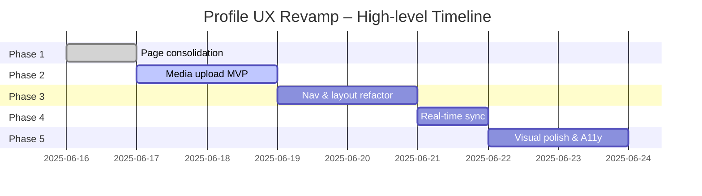

## Profile System UX Improvement — Implementation Plan (Generated 2025-06-15)

This document converts the high-level findings in `profile-system-ux-audit-2025-06-15.md` into an actionable, code-oriented roadmap. It is organised into **Phases** (roughly 1–2 week sprints) and **Batches** (ticket groups that can be parallelised inside a Phase).

---

### Phase 1 — Consolidate Core Page & Remove Legacy Code (@routeDeprecation, @zoneImports)

| Batch | Goal                            | Key Tasks                                                                                                                                                                               | Primary Files / Paths                                      | Est. Effort |
| ----- | ------------------------------- | --------------------------------------------------------------------------------------------------------------------------------------------------------------------------------------- | ---------------------------------------------------------- | ----------- |
| 1A    | Decommission `profile-page.tsx` | ✅ **Completed** • Deleted legacy file. • Updated all internal `/profile` links to dynamic `/profile/${username}`. • Route consolidated to `[username].tsx` only.           | `client/src/pages/profile-page.tsx`, navigation components | 0.5 d       |
| 1B    | Canonical routing               | ✅ **Completed** • Updated route in `App.tsx` to `/profile/:username` (non-optional). • Mobile nav now builds URL with current user. • Redirect helper TBD in sitemap task. | `client/src/App.tsx`, `mobile-nav-bar.tsx`                 | 0.5 d       |
| 1C    | Dead-code purge                 | ✅ \*\*Completed (partial) • `ProfileContext` and unused imports removed. • Rarity enum consolidation pending.                                                                  | `client/src/contexts/profile-context.tsx`                  | 0.5 d       |

Deliverable: Single source-of-truth profile page, no dangling legacy routes, CI passes.

---

### Phase 2 — Media Upload MVP (@segregateLogic, @schemaConsistency)

| Batch | Goal                | Key Tasks                                                                                                                                          | Files / Paths                            | Est. Effort |
| ----- | ------------------- | -------------------------------------------------------------------------------------------------------------------------------------------------- | ---------------------------------------- | ----------- |
| 2A    | Front-end drop zone | ✅ **Completed** • Added reusable `<FileDropZone>` component. • Integrated into `ProfileEditor.tsx`.                                       | `FileDropZone.tsx`, `ProfileEditor.tsx`  | 1 d         |
| 2B    | Signed upload API   | ✅ **Completed (stub)** • Created `uploads` domain with route, controller, service (stub presign URLs). • Registered under `/api/uploads`. | `server/src/domains/uploads/**`          | 1 d         |
| 2C    | DB + Service wiring | • Update `users.avatar_url`, `users.banner_url` after upload. • Emit `profileUpdated` WS event (see Phase 4).                                  | `db/schema/user/*`, `profile.service.ts` | 0.5 d       |
| 2D    | Progress & Toasts   | • Display upload progress bar and success/error toasts.                                                                                            | `FileDropZone.tsx`, `useToast`           | 0.5 d       |

Deliverable: Users can change avatar & banner; images stored; UI feedback.

---

### Phase 3 — Navigation & Layout Refactor (@uiLogicSegregation)

| Batch | Goal                    | Key Tasks                                                                                                                             | Files / Paths                            | Effort |
| ----- | ----------------------- | ------------------------------------------------------------------------------------------------------------------------------------- | ---------------------------------------- | ------ |
| 3A    | Flex Bar                | Implement `FlexBar.tsx` under `client/src/components/profile/` according to spec (avatar frame, status line, pinned post).            | `FlexBar.tsx`, supporting sub-components | 1 d    |
| 3B    | Persistent Sub-nav      | • Create `ProfileNavBar.tsx` (sticky pills). • Create nested sub-routes in `pages/profile/[username]/(sub)/` as shells.           | 1 d                                      |
| 3C    | Responsive Tab Overflow | • Replace `TabsList` in `[username].tsx` with scrollable flex container (`overflow-x-auto`). • Add icon-only breakpoint < 400 px. | `[username].tsx` lines ~1120             | 0.5 d  |

Deliverable: Modern profile header & smooth mobile nav.

---

### Phase 4 — Real-time Profile Data Sync (@auditOnChange)

| Batch | Goal               | Tasks                                                                                                                            | Paths                                                                          | Effort |
| ----- | ------------------ | -------------------------------------------------------------------------------------------------------------------------------- | ------------------------------------------------------------------------------ | ------ |
| 4A    | WS event           | • Publish `profile:update` on avatar/banner/title change. • Client subscribes (`useProfileEvents.ts`).                       | `server/src/domains/profile/events.ts`, `client/src/hooks/useProfileEvents.ts` | 1 d    |
| 4B    | Query invalidation | • Inside `[username].tsx`, listen → `queryClient.invalidateQueries(['profile', username])`. • Optimistically `setQueryData`. | `[username].tsx`                                                               | 0.5 d  |

---

### Phase 5 — Visual Polish & Accessibility

Checklist (can be tackled incrementally):

- Compress banner height (`ProfileBackground.tsx`).
- `StatCard` grid → `auto-fit` responsive template.
- Add `aria-label` to Follow/Whisper etc.
- WCAG contrast fixes for rarity badges.

Est. Effort: 1.5 d total.

---

### Phase 6 — Feature Enhancements (Phase 1.5 from audit)

| Feature             | Key Files                                                           | Note                        |
| ------------------- | ------------------------------------------------------------------- | --------------------------- |
| Recent Activity Tab | `RecentActivityTab.tsx`, backend route `profile.activity.routes.ts` | Depends on event_logs index |
| Quick Loadout Bar   | `QuickLoadoutBar.tsx`                                               | Own-profile only            |
| X Account Linking   | `xAuthService.ts`, new OAuth flow                                   | Security review             |
| XP Heatmap          | `XPHeatmap.tsx`, query `xpLogs`                                     | after daily job             |

These can be split into future sprints.

---

## Cross-Cutting Concerns

1. **Schema Sync** — any DB changes invoke `@syncSchema` cheat code. Remember to regenerate Drizzle types.
2. **Testing** — add Cypress smoke tests for viewing own vs public profile, avatar upload, navigation.
3. **Docs** — Update `README.md` profile section & add API docs to `docs/profile-api.md`.

---

### Timeline Overview

> **NOTE:** Dates assume immediate start and single-developer focus; adjust per team velocity.

---

### Open Questions

1. Confirm storage provider (AWS S3 vs Supabase) for media uploads.
2. Decide on routing library upgrade (wouter → React Router v6) for nested routes ease.
3. Clarify if `pinned_post_id` should be nullable FK or separate join table for future multi-pin.

---

**Next Action:** Kick off **Phase 1 Batch 1A** – delete legacy `profile-page.tsx` and update links. Create Jira ticket `PROF-101`.
