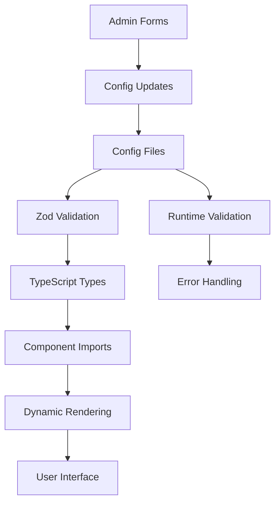

# Configuration System Integration Guide

## 🔗 **How Configuration Integrates with the Codebase**

This guide explains how the Degentalk™ configuration system seamlessly integrates with various parts of the application to provide a centralized, maintainable solution for all configurable values.

## 🏗️ **System Architecture**

### Configuration Flow



### Integration Points

| Component Type | Integration Method | Config Usage | Examples |
|----------------|-------------------|--------------|----------|
| **Admin Forms** | Dynamic dropdowns from config | `Object.values(config.section)` | User role dropdowns, rarity selectors |
| **UI Components** | Styling classes from config | `config.styles[item].cssClasses` | Badge colors, tag styling |
| **Business Logic** | Limits and thresholds | `config.economy.limits.maxTip` | Tip validation, XP calculations |
| **Navigation** | Route definitions | `config.adminRoutes.sections` | Admin menu generation |

## 📋 **Integration Patterns by Domain**

### 1. Admin Interface Integration

#### Dynamic Form Options

```typescript
// Example: Badge rarity selector
import { cosmeticsConfig } from '@/config/cosmetics.config.ts';

function BadgeRaritySelector() {
  // [CONFIG-REFAC] Replaced hardcoded rarities with cosmeticsConfig.rarities
  const rarityOptions = Object.values(cosmeticsConfig.rarities).map(rarity => ({
    value: rarity.key,
    label: rarity.label,
    className: rarity.tailwindClass
  }));

  return (
    <select>
      {rarityOptions.map(option => (
        <option key={option.value} value={option.value}>
          {option.label}
        </option>
      ))}
    </select>
  );
}
```

#### Permission-Based Rendering

```typescript
// Example: Admin menu items based on roles
import { rolesConfig } from '@/config/roles.config.ts';

function AdminMenuItem({ requiredPermission, userRole, children }) {
  const hasPermission = rolesConfig.roles[userRole]?.permissions.includes(requiredPermission);
  
  return hasPermission ? children : null;
}
```

### 2. Forum Component Integration

#### Dynamic Styling

```typescript
// Example: Forum tag styling
import { cosmeticsConfig } from '@/config/cosmetics.config.ts';

function ForumTag({ tagType, children }) {
  // [CONFIG-REFAC] Replaced hardcoded tag styles with cosmeticsConfig.tagStyles
  const tagStyle = cosmeticsConfig.tagStyles[tagType];
  
  return (
    <span className={`base-tag-classes ${tagStyle?.cssClasses}`}>
      {children}
    </span>
  );
}
```

#### Forum Structure

```typescript
// Example: Forum zone navigation
import { forumRulesConfig } from '@/config/forumRules.config.ts';

function ForumNavigation() {
  return (
    <nav>
      {Object.values(forumRulesConfig.forums).map(forum => (
        <NavItem 
          key={forum.slug}
          href={`/forums/${forum.slug}`}
          icon={forum.icon}
        >
          {forum.name}
        </NavItem>
      ))}
    </nav>
  );
}
```

### 3. Economic System Integration

#### Reward Calculations

```typescript
// Example: XP reward calculation
import { economyConfig } from '@/config/economy.config.ts';

function calculateXpReward(actionType: string): number {
  // [CONFIG-REFAC] Replaced hardcoded XP values with economyConfig.xp
  const xpRewards = economyConfig.xp;
  
  switch (actionType) {
    case 'newThread': return xpRewards.newThread;
    case 'newPost': return xpRewards.newPost;
    case 'receivedLike': return xpRewards.receivedLike;
    default: return xpRewards.generalXpPerAction;
  }
}
```

#### Validation Rules

```typescript
// Example: Tip amount validation
import { economyConfig } from '@/config/economy.config.ts';

function validateTipAmount(amount: number): { valid: boolean; error?: string } {
  const { minAmountDGT, maxAmountDGT } = economyConfig.tipRain.tip;
  
  if (amount < minAmountDGT) {
    return { valid: false, error: `Minimum tip is ${minAmountDGT} DGT` };
  }
  
  if (amount > maxAmountDGT) {
    return { valid: false, error: `Maximum tip is ${maxAmountDGT} DGT` };
  }
  
  return { valid: true };
}
```

## 🔧 **Component-Specific Integration**

### Admin Dashboard Components

```typescript
// Integration pattern for admin components
import { 
  cosmeticsConfig,
  economyConfig,
  rolesConfig 
} from '@/config/*.config.ts';

function AdminDashboard() {
  const stats = {
    totalRarities: Object.keys(cosmeticsConfig.rarities).length,
    maxTipAmount: economyConfig.tipRain.tip.maxAmountDGT,
    totalRoles: Object.keys(rolesConfig.roles).length
  };

  return <DashboardStats {...stats} />;
}
```

### Shop Components

```typescript
// Shop item rendering with config-driven pricing
import { cosmeticsConfig } from '@/config/cosmetics.config.ts';

function ShopItem({ itemId }) {
  const item = cosmeticsConfig.items[itemId];
  const rarity = cosmeticsConfig.rarities[item.rarity];
  
  return (
    <div className={`shop-item ${rarity.tailwindClass}`}>
      <h3>{item.name}</h3>
      <p>{item.description}</p>
      <span className="price">{item.price} DGT</span>
    </div>
  );
}
```

### Forum Filter Components

```typescript
// Dynamic filter options from config
import { forumRulesConfig } from '@/config/forumRules.config.ts';

function ThreadFilters() {
  // [CONFIG-REFAC] Replaced hardcoded filter options with forumRulesConfig
  const statusOptions = forumRulesConfig.threadStatusOptions;
  const sortOptions = forumRulesConfig.threadSortOptions;
  
  return (
    <div className="thread-filters">
      <FilterDropdown options={statusOptions} />
      <SortDropdown options={sortOptions} />
    </div>
  );
}
```

## 🔄 **Runtime Integration**

### Configuration Loading

```typescript
// App initialization with config validation
import { validateAllConfigs } from '@/config/validation.ts';

function App() {
  useEffect(() => {
    try {
      validateAllConfigs();
      console.log('✅ All configurations validated successfully');
    } catch (error) {
      console.error('❌ Configuration validation failed:', error);
    }
  }, []);

  return <AppContent />;
}
```

### Hot Configuration Updates

```typescript
// Future: Runtime configuration updates
function ConfigProvider({ children }) {
  const [config, setConfig] = useState(defaultConfig);
  
  const updateConfig = useCallback((newConfig) => {
    try {
      validateConfig(newConfig);
      setConfig(newConfig);
    } catch (error) {
      console.error('Invalid configuration update:', error);
    }
  }, []);

  return (
    <ConfigContext.Provider value={{ config, updateConfig }}>
      {children}
    </ConfigContext.Provider>
  );
}
```

## 🔍 **Debugging Integration**

### Finding Configuration Usage

```bash
# Find all components using specific configs
grep -r "cosmeticsConfig\." client/src/components/
grep -r "economyConfig\." client/src/pages/
grep -r "\[CONFIG-REFAC\]" client/src/

# Find potential hardcoded values that need migration
grep -r "TODO.*config" client/src/
grep -r "hardcoded" client/src/
```

### Validation Debugging

```typescript
// Component with config validation debugging
import { cosmeticsConfigSchema } from '@/config/cosmetics.config.ts';

function ComponentWithValidation() {
  useEffect(() => {
    try {
      cosmeticsConfigSchema.parse(cosmeticsConfig);
    } catch (error) {
      console.error('Cosmetics config validation failed:', error.issues);
    }
  }, []);
}
```

## 📈 **Performance Considerations**

### Import Optimization

```typescript
// ✅ Tree-shakable imports
import { cosmeticsConfig } from '@/config/cosmetics.config.ts';
const rarity = cosmeticsConfig.rarities.legendary;

// ❌ Avoid full config imports in components that only need small parts
import * as allConfigs from '@/config/index.ts';
```

### Memoization for Computed Values

```typescript
// Memoize expensive config computations
import { useMemo } from 'react';
import { cosmeticsConfig } from '@/config/cosmetics.config.ts';

function ExpensiveComponent() {
  const sortedRarities = useMemo(() => 
    Object.values(cosmeticsConfig.rarities)
      .sort((a, b) => a.label.localeCompare(b.label)),
    []
  );

  return <RarityList rarities={sortedRarities} />;
}
```

## 🚀 **Future Integration Enhancements**

### Environment-Specific Configurations

```typescript
// Future: Environment-based config overrides
const config = {
  ...baseConfig,
  ...(process.env.NODE_ENV === 'development' ? devOverrides : {}),
  ...(process.env.NODE_ENV === 'production' ? prodOverrides : {})
};
```

### Admin Configuration Interface

```typescript
// Future: Runtime config editing
function ConfigEditor() {
  const [localConfig, setLocalConfig] = useState(globalConfig);
  
  const saveConfig = async () => {
    await api.updateConfig(localConfig);
    // Trigger app-wide config refresh
  };
}
```

## 📚 **Integration Best Practices**

1. **Always import full config objects** rather than destructuring
2. **Use TypeScript autocomplete** to discover available configuration options
3. **Add `[CONFIG-REFAC]` comments** when replacing hardcoded values
4. **Test configuration changes thoroughly** across all affected components
5. **Document integration patterns** for complex configuration usage
6. **Validate configurations at runtime** to catch errors early

---

*This integration guide evolves with the configuration system. Update it when adding new integration patterns or architectural changes.*
