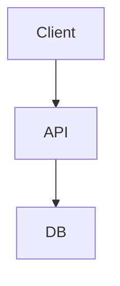

# 📝 Documentation Style Guide

This guide defines voice, structure, and formatting rules for all Degentalk docs.

## Voice & Tone

| Principle | Example |
|-----------|---------|
| **Active voice** | "Run `npm install`" instead of "`npm install` should be run". |
| **Present tense** | "The API returns JSON" not "will return". |
| **Inclusive language** | Avoid gendered pronouns; use "they". |
| **Concise** | Short sentences (< 25 words) and bullet lists. |
| **Developer-first** | Prioritise code samples over prose. |

## File Requirements

1. **YAML front-matter** at top (title, status, updated).  Example:
   ```yaml
   ---
   title: Forum API
   status: STABLE
   updated: 2025-06-28
   ---
   ```
2. **Heading depth ≤ 3** (`###`).
3. Wrap code blocks with language hints (` ```ts `, ` ```bash `).
4. Prefer tables for option matrices and parameter lists.
5. Use emoji sparingly—only to enhance scanning (`✅`, `⚠️`).

## Directory Conventions

| Path | Purpose |
|------|---------|
| `docs/api/` | External API reference |
| `docs/architecture/` | High-level system design & ADRs |
| `docs/guides/` | How-to developer guides |
| `docs/development/` | Internal dev process & performance notes |
| `docs/ui/` | Frontend design guidelines |
| `docs/archive/` | Time-boxed or obsolete material |

## Diagram Standards

Use Mermaid where possible:

Wrap definition in a fenced block with `mermaid`.

## Change Log

Update the **updated** date in front-matter when meaningfully editing a doc. 