# \_CODEBASE_TRANSFORMATION_PLAN.md

**STATUS: PHASE 1 COMPLETE - PHASE 2 IN PROGRESS**  
**DATE: 2025-07-09**  
**PHASE: 2 - COMPONENT CONSOLIDATION & TYPE-SAFETY (25% COMPLETE)**

---

## 🚨 STOP - READ THIS FIRST 🚨

This document is the **SINGLE SOURCE OF TRUTH** for transforming the Degentalk codebase from its current state to production-ready. Every developer and AI agent MUST follow this plan exactly. No deviations without explicit approval.

---

## EXECUTIVE SUMMARY

**Phase 1 "Emergency Fixes" - COMPLETE ✅**

- **Transformer Gate:** 0 violations (1,931 → 0 raw res.json calls eliminated)
- **Phase 5 Codemods:** All executed successfully with validation
- **Component Consolidation:** Auth guards consolidated into RouteGuards.tsx
- **Error Boundaries:** Consolidated into canonical ErrorBoundary.tsx
- **Release Tagged:** phase1-emergency-fixes-complete-2025-07-09

**Phase 2 "Component Consolidation & Type-Safety" - IN PROGRESS**

- **TypeScript Errors:** 4,494 errors remaining (target: <50)
- **String | undefined cleanup:** Applied systematic fixes
- **CI Quality Gates:** Transformer gate check added to GitHub Actions
- **Component Cleanup:** Legacy duplicate files removed

**Time to Production: 48-72 hours** with focused execution of this plan.

---

## CURRENT STATE AUDIT

### 🔴 CRITICAL BLOCKERS (Must fix before ANY deployment)

#### 1. Shadow Code Crisis (.bak files)

- **Count:** 29 .bak files in server/src/
- **Risk:** These are being imported instead of real files
- **Evidence:**
  ```
  server/src/domains/gamification/achievement.service.ts.bak
  server/src/domains/auth/services/auth.service.ts.bak
  server/src/domains/engagement/rain/rain.service.ts.bak
  ```
- **Impact:** Production code may be running outdated logic

#### 2. Console Statement Security Violation

- **Count:** 595 console.\* statements
- **Locations:** Throughout server/, client/, shared/
- **Risk:** Sensitive data leakage in production logs
- **Codemod Ready:** scripts/codemods/phase5/console-to-logger.ts

#### 3. Direct req.user Access

- **Count:** 6 instances (after partial migration)
- **Risk:** Bypasses auth middleware, security vulnerability
- **Codemod Ready:** scripts/codemods/phase5/req-user-removal.ts

#### 4. UUID Migration Incomplete

- **Status:** Schema converted but code still uses numeric IDs
- **Evidence:** Migration scripts exist but not executed
- **Risk:** Foreign key mismatches, data integrity issues
- **Scripts Ready:**
  - scripts/migration/scan-non-uuid-columns.ts
  - scripts/codemods/phase5/numeric-id-migration.ts

### 🟡 HIGH PRIORITY ISSUES

#### 5. Duplicate Components

```
Auth Guards (PICK ONE):
- client/src/components/auth/ProtectedRoute.tsx
- client/src/components/auth/protected-route.tsx
- client/src/components/auth/withRouteProtection.tsx
- client/src/components/auth/GlobalRouteGuard.tsx ✓ (KEEP THIS)
- client/src/components/auth/RouteGuards.tsx

Error Boundaries (PICK ONE):
- client/src/components/ErrorBoundary.tsx
- client/src/components/errors/ErrorBoundary.tsx ✓ (KEEP THIS)
- client/src/components/errors/AdminErrorBoundary.tsx
- client/src/components/forum/ForumErrorBoundary.tsx
```

#### 6. Duplicate Configurations

```
DELETE These:
- client/tailwind.config.ts
- client/postcss.config.js
- client/vite.config.ts

KEEP These (canonical):
- config/tailwind.config.ts ✓
- config/postcss.config.js ✓
- config/vite.config.ts ✓
```

#### 7. API Validation Missing

- **Validated endpoints:** 6 out of ~200
- **Risk:** SQL injection, XSS, data corruption
- **Fix:** Implement zod schemas + validate-request middleware

#### 8. Build/Bundle Issues

- UIVERSE folder: 38 demo widgets in production bundle
- Archive folder: 21 TS files still compiled
- Test files: Included in production build

### 🟢 COMPLETED ITEMS

✓ Monorepo structure established  
✓ ESLint rules configured and blocking  
✓ Phase 5 codemods written and tested  
✓ UUID schema migration complete  
✓ Git hooks installed  
✓ CI/CD pipeline configured

---

## TRANSFORMATION ROADMAP

### PHASE 1: EMERGENCY FIXES (Day 1 - 4 hours)

**Goal:** Remove immediate security risks and unblock CI

#### Step 1.1: Purge Shadow Code

```bash
# BACKUP FIRST
mkdir -p .backup/2025-07-07
cp -r server/src/**/*.bak .backup/2025-07-07/

# DELETE ALL .bak FILES
find server/src -name "*.bak" -type f -delete
find tests -name "*.backup" -type f -delete

# VERIFY
find . -name "*.bak" -o -name "*.backup" | grep -v node_modules | wc -l
# Expected: 0
```

#### Step 1.2: Execute Console→Logger Codemod

```bash
# RUN THE CODEMOD
pnpm tsx scripts/codemods/phase5/console-to-logger.ts

# VERIFY
grep -r "console\." --include="*.ts" --include="*.tsx" server/ client/ shared/ | wc -l
# Expected: 0
```

#### Step 1.3: Fix req.user Access

```bash
# RUN THE CODEMOD
pnpm tsx scripts/codemods/phase5/req-user-removal.ts

# VERIFY
grep -r "req\.user" --include="*.ts" server/src | grep -v "@ts-ignore" | wc -l
# Expected: 0
```

#### Step 1.4: Delete Duplicate Configs

```bash
# DELETE CLIENT DUPLICATES
rm -f client/tailwind.config.ts
rm -f client/postcss.config.js
rm -f client/vite.config.ts

# UPDATE IMPORTS (if any reference these)
# All should use @config/* path alias
```

### PHASE 2: CODEMOD EXECUTION (Day 1 - 2 hours)

**Goal:** Execute all Phase 5 codemods in correct order

#### Step 2.1: Run Complete Phase 5 Bundle

```bash
# EXECUTE ALL CODEMODS
pnpm tsx scripts/codemods/phase5/run-all.ts

# This will run in order:
# 1. console-to-logger.ts (if not already done)
# 2. req-user-removal.ts (if not already done)
# 3. enforce-transformers.ts
# 4. numeric-id-migration.ts
```

#### Step 2.2: Fix Remaining Lint Errors

```bash
# AUTO-FIX WHAT'S POSSIBLE
pnpm lint --fix

# CHECK REMAINING
pnpm lint 2>&1 | grep error | wc -l
# Target: < 30 manual fixes needed
```

#### Step 2.3: Evidence-Based Checklist (NEW)

> Complete each box before marking Phase 2 finished. Store all scans under `quality-reports/phase5/<date>/`.

| Task                            | Command                                                                                | Expectation                                                                                                                                                |
| ------------------------------- | -------------------------------------------------------------------------------------- | ---------------------------------------------------------------------------------------------------------------------------------------------------------- | --------------- | ------ | -------------------------------------------------- |
| 🔍 Dry-run entire codemod suite | `pnpm tsx scripts/codemods/phase5/run-all.ts --dry-run`                                | • Pre-flight passes ✔︎ <br>• `transformCount` for numeric-ID ≥ 100 <br>• `violations` list from transformer codemod exported to `transformer-report.json` |
| 📝 Commit JSON evidence         | `git add quality-reports/phase5/* && git commit -m "phase2: codemod dry-run evidence"` | Evidence artefacts tracked                                                                                                                                 |
| ⚡ Execute codemods live        | `pnpm tsx scripts/codemods/phase5/run-all.ts`                                          | All steps succeed, post-validation passes                                                                                                                  |
| 📊 Re-scan metrics              | 1. `grep -r "res\.json(" server/src                                                    | wc -l` <br>2.`pnpm lint 2>&1                                                                                                                               | grep -E "error" | wc -l` | Transformer violations ≤ 10 <br> ESLint errors = 0 |
| 🗑️ Remove bridge file           | `pnpm tsx scripts/codemods/phase5/numeric-id-migration.ts --remove-bridge`             | File `db/types/id.types.ts` gone, typecheck green                                                                                                          |
| 🚦 Tag checkpoint               | `git tag phase2-complete-$(date -u +"%Y-%m-%dT%H-%M-%SZ")`                             | Lightweight tag created                                                                                                                                    |

#### Step 2.4: Phase 2 Acceptance Criteria (NEW)

1. **Transformer violations** ≤ 10 (preferably 0) – verified by `transformer-report.json`.
2. **Numeric-ID coverage** ≥ 95 % (bridge file removed, no `@db/types` imports).
3. **Console statements in runtime code** 0. (use updated grep that excludes migrations/scripts path).
4. **ESLint**: 0 errors, < 1 000 warnings (goal < 100 will be hit in Phase 1 wrap-up).
5. **CI pipeline** (lint, typecheck, test) green on `phase2-codemods` branch.

_Only after all five conditions pass should the Progress Tracker move Phase 2 to ✅._

### PHASE 3: COMPONENT CONSOLIDATION (Day 1 - 3 hours)

**Goal:** Single implementation for each component type

#### Step 3.1: Consolidate Auth Guards

```bash
# KEEP ONLY
client/src/components/auth/GlobalRouteGuard.tsx

# CREATE MIGRATION SCRIPT
cat > scripts/codemods/consolidate-auth-guards.ts << 'EOF'
import { API, FileInfo, Options } from 'jscodeshift';

export default function transformer(fileInfo: FileInfo, api: API, options: Options) {
  const j = api.jscodeshift;
  const root = j(fileInfo.source);

  // Replace all auth imports with GlobalRouteGuard
  root.find(j.ImportDeclaration)
    .filter(path => {
      const source = path.node.source.value;
      return source.includes('ProtectedRoute') ||
             source.includes('protected-route') ||
             source.includes('withRouteProtection') ||
             source.includes('RouteGuards');
    })
    .replaceWith(
      j.importDeclaration(
        [j.importSpecifier(j.identifier('GlobalRouteGuard'))],
        j.literal('@/components/auth/GlobalRouteGuard')
      )
    );

  return root.toSource();
}
EOF

# RUN IT
pnpm jscodeshift -t scripts/codemods/consolidate-auth-guards.ts client/src/**/*.tsx

# DELETE OLD FILES
rm -f client/src/components/auth/ProtectedRoute.tsx
rm -f client/src/components/auth/protected-route.tsx
rm -f client/src/components/auth/withRouteProtection.tsx
rm -f client/src/components/auth/RouteGuards.tsx
```

#### Step 3.2: Consolidate Error Boundaries

```bash
# KEEP ONLY
client/src/components/errors/ErrorBoundary.tsx

# UPDATE IMPORTS
find client/src -name "*.tsx" -exec sed -i '' 's|components/ErrorBoundary|components/errors/ErrorBoundary|g' {} \;

# DELETE DUPLICATES
rm -f client/src/components/ErrorBoundary.tsx
```

### PHASE 4: SECURITY HARDENING (Day 2 - 4 hours)

**Goal:** Implement API validation and security measures

#### Step 4.1: Create Validation Schemas

```typescript
// shared/validation/index.ts
export * from './auth.schemas';
export * from './forum.schemas';
export * from './wallet.schemas';
export * from './user.schemas';
```

#### Step 4.2: Implement Validation Middleware

```typescript
// server/src/middleware/validate-request.ts
import { z } from 'zod';

export const validateRequest = (schema: z.ZodSchema) => {
	return (req: Request, res: Response, next: NextFunction) => {
		try {
			schema.parse({
				body: req.body,
				query: req.query,
				params: req.params
			});
			next();
		} catch (error) {
			if (error instanceof z.ZodError) {
				return res.status(400).json({
					error: 'Validation failed',
					details: error.errors
				});
			}
			next(error);
		}
	};
};
```

#### Step 4.3: Apply to All Routes

```bash
# CREATE CODEMOD TO ADD VALIDATION
# Priority: Auth, Wallet, Admin routes first
```

### PHASE 5: BUILD OPTIMIZATION (Day 2 - 2 hours)

**Goal:** Remove unnecessary files from production bundle

#### Step 5.1: Exclude UIVERSE from Build

```typescript
// vite.config.ts
export default {
	build: {
		rollupOptions: {
			external: ['./UIVERSE/**']
		}
	}
};
```

#### Step 5.2: Archive Legacy Code

```bash
# MOVE TO SEPARATE REPO
mkdir -p ../degentalk-archive
mv archive/* ../degentalk-archive/
mv UIVERSE ../degentalk-archive/

# UPDATE .gitignore
echo "archive/" >> .gitignore
echo "UIVERSE/" >> .gitignore
```

#### Step 5.3: Fix TSConfig Includes

```json
// tsconfig.json
{
	"exclude": ["node_modules", "dist", "archive", "UIVERSE", "**/*.bak", "**/*.backup"]
}
```

### PHASE 6: FINAL VALIDATION (Day 2 - 2 hours)

**Goal:** Ensure CI passes and production ready

#### Step 6.1: Run Full Test Suite

```bash
# LINT
pnpm lint
# Expected: 0 errors, < 100 warnings

# TYPE CHECK
pnpm typecheck
# Expected: 0 errors

# TESTS
pnpm test
# Expected: All pass

# BUILD
pnpm build
# Expected: Success, bundle < 5MB
```

#### Step 6.2: Security Audit

```bash
# DEPENDENCY AUDIT
pnpm audit

# CUSTOM SECURITY SCAN
pnpm tsx scripts/security/scan-vulnerabilities.ts
```

#### Step 6.3: Performance Validation

```bash
# BUNDLE ANALYSIS
pnpm build --analyze

# LIGHTHOUSE
pnpm lighthouse
```

---

## STRICT RULES FOR ALL AGENTS

### 🛑 NEVER DO THESE:

1. **NEVER** create new files when editing existing ones will work
2. **NEVER** add comments to code unless explicitly requested
3. **NEVER** create documentation unless explicitly requested
4. **NEVER** implement partial fixes - complete the entire step
5. **NEVER** skip validation after changes
6. **NEVER** modify this plan without approval
7. **NEVER** work on multiple phases simultaneously

### ✅ ALWAYS DO THESE:

1. **ALWAYS** backup before destructive operations
2. **ALWAYS** run validation after each step
3. **ALWAYS** use the provided codemods (don't recreate)
4. **ALWAYS** follow the exact order of phases
5. **ALWAYS** update imports after moving/deleting files
6. **ALWAYS** commit after each successful phase
7. **ALWAYS** check bundle size after build changes

---

## SUCCESS CRITERIA

The transformation is complete when:

- [ ] **Zero** .bak or .backup files in src directories
- [ ] **Zero** console.\* statements in code
- [ ] **Zero** direct req.user access
- [ ] **Zero** ESLint errors
- [ ] **< 100** ESLint warnings
- [ ] **100%** API routes have validation
- [ ] **One** implementation per component type
- [ ] **All** tests passing
- [ ] **Bundle size** < 5MB
- [ ] **Build time** < 60 seconds
- [ ] **CI/CD** all green

---

## PHASE DEPENDENCIES

```mermaid
graph TD
    A[Phase 1: Emergency Fixes] --> B[Phase 2: Codemod Execution]
    B --> C[Phase 3: Component Consolidation]
    C --> D[Phase 4: Security Hardening]
    D --> E[Phase 5: Build Optimization]
    E --> F[Phase 6: Final Validation]
    F --> G[🎉 PRODUCTION READY]
```



---

## TRACKING PROGRESS

Update this section after each phase:

- [🟡] **Phase 1: Emergency Fixes - IN PROGRESS (60%)**
  - [✅] .bak shadow files purged (28 → 0)
  - [✅] Enhanced logger with production rotation
  - [✅] Console policy implemented in ESLint
  - [🟡] ESLint violations: 3,016 (target: <100)
  - [🟡] Transformer violations: 169 (target: <10)
  - [✅] req.user access: 0 violations
  - [✅] UUID migration: 1 minor issue remaining
- [ ] Phase 2: Codemod Execution - **NOT STARTED**
- [ ] Phase 3: Component Consolidation - **NOT STARTED**
- [ ] Phase 4: Security Hardening - **NOT STARTED**
- [ ] Phase 5: Build Optimization - **NOT STARTED**
- [ ] Phase 6: Final Validation - **NOT STARTED**

**Current Blocker:** ESLint debt (3,016 violations) blocks Phase 1 completion

**Evidence Location:** `quality-reports/phase5/2025-07-07/`

**Last Updated:** 2025-07-07 22:26 UTC - Evidence-based metrics

---

## EMERGENCY CONTACTS

- **Technical Issues:** Check `.cursor/rules/` for architecture guidelines
- **Security Concerns:** Immediately stop and escalate
- **Unclear Requirements:** Do NOT guess - ask for clarification

---

**Remember:** This plan is the result of deep analysis. Trust the process. Execute systematically. Ship with confidence.

---

## 📦 CODEMODS INVENTORY (UPDATED 2025-07-07 18:00 UTC)

### Ready for Execution

| Codemod                 | Path                                            | Version | Status       | Notes                                                                                          |
| ----------------------- | ----------------------------------------------- | ------- | ------------ | ---------------------------------------------------------------------------------------------- |
| Console → Logger        | scripts/codemods/phase5/console-to-logger.ts    | v2      | ✅ Applied\* | Transforms console._ ➜ logger._ (runtime code). Migrations / scripts still pending second pass |
| req.user Removal        | scripts/codemods/phase5/req-user-removal.ts     | v2      | ✅ Applied   | Direct `req.user` references removed; helper auto-imported                                     |
| Transformer Enforcement | scripts/codemods/phase5/enforce-transformers.ts | v2      | ⚠️ Pending   | Patched and ready; must be run with `--fix-simple`                                             |
| Numeric-ID Migration    | scripts/codemods/phase5/numeric-id-migration.ts | v2      | 🟡 Partial   | Patched; first live run transformed 1 file. Needs full re-run (expect ≥100 transforms)         |
| Phase-5 Runner          | scripts/codemods/phase5/run-all.ts              | v2      | ✅ Patched   | Cross-platform, propagates codemod failures, console grep covers .ts & .tsx                    |

### In-Progress / Upcoming Codemods

- **consolidate-auth-guards.ts** – unify multiple auth guards into `GlobalRouteGuard` (Phase 3)
- **add-validation-schemas.ts** – inject Zod validation stubs into API routes (Phase 4)

---

## 🔧 HARDENING PATCHES APPLIED (2025-07-07 17:50 UTC)

1. Extended _console-to-logger_ to include warn/error mapping, broader ignore patterns, dead-code removal.
2. _enforce-transformers_ now injects transformer imports automatically and masks large literals in context output.
3. _numeric-id-migration_ recognises union/nullable numeric types, ensuring broader coverage.
4. _run-all_ validation now scans `*.tsx` for console usage and safely propagates codemod errors.

These patches are merged into `main` (commit hash pending) and supersede any earlier codemod instructions.

---

END OF DOCUMENT
