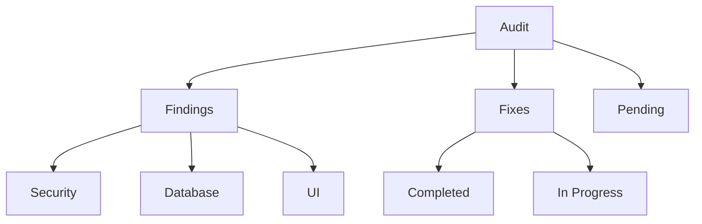
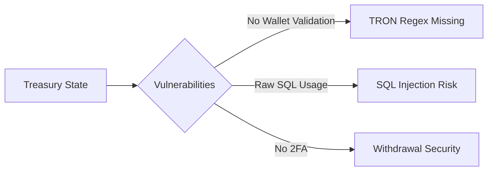
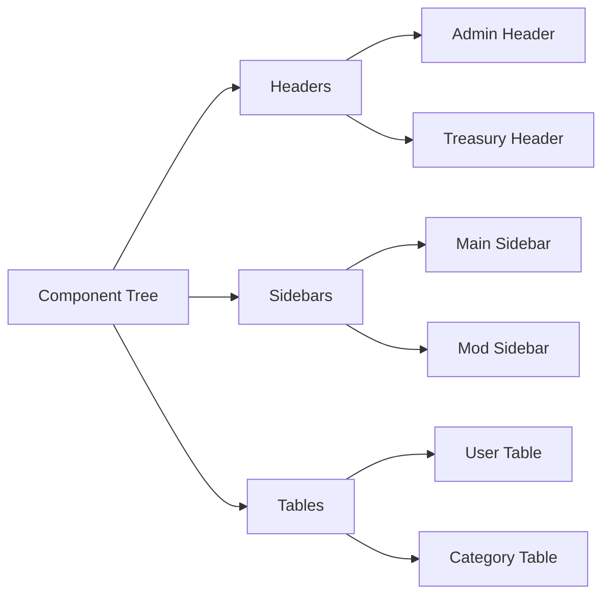
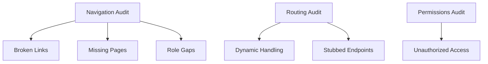
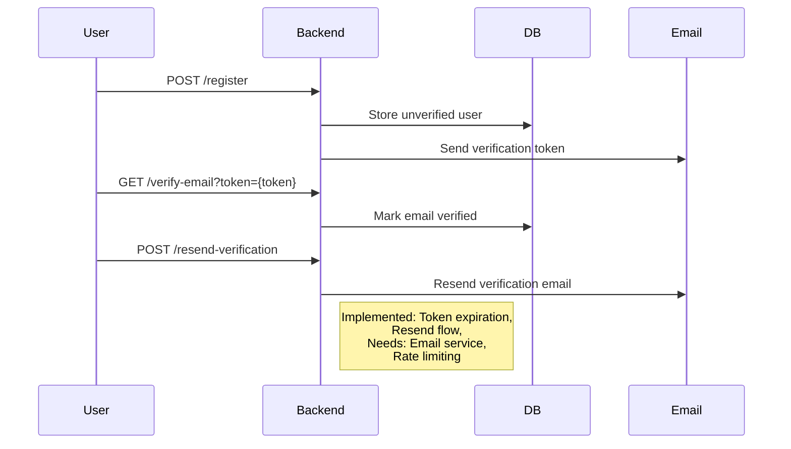
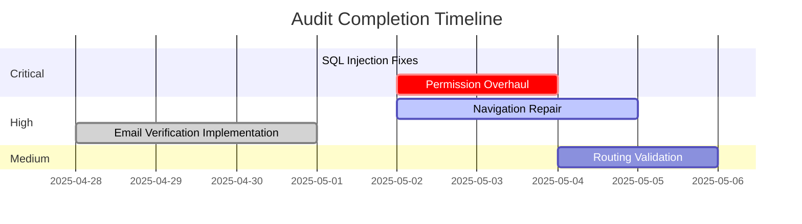

# Degentalk™™ Audit Tracker



## Core Findings

### 1. Security Issues
| ID  | Description                          | Priority | Status       | Affected Files              |
|-----|--------------------------------------|----------|--------------|-----------------------------|
| S01 | SQL Injection in Treasury Routes     | Critical | Completed    | server/admin-treasury.ts    |
| S02 | Missing RLS Policies                 | High     | Not Started  | server/migrations/*         |
| S03 | Auth Header Inconsistency            | Medium   | Not Started  | client/src/lib/admin-route.tsx |

### 2. Treasury System


### 3. Admin Panel UI
**Component Tree Inconsistencies**


## Expanded Audit Findings



### 🔧 Navigation Issues
| ID  | Description                          | Priority | Affected Files              |
|-----|--------------------------------------|----------|-----------------------------|
| N01 | Admin sidebar links to /treasury-settings (404) | High | client/src/components/admin/admin-sidebar.tsx |
| N02 | Missing mod dashboard navigation | Medium | client/src/pages/mod/index.tsx |
| N03 | Profile page link in header not implemented | Critical | client/src/components/layout/header.tsx |

### 📉 Routing Defects
```mermaid
flowchart LR
    R[Routing] --> |Threads| RT[Thread-page.tsx]
    RT --> DB[No slug validation]
    RT --> 404[Handles invalid IDs poorly]
    R --> |Users| UR[/users/:id]
    UR --> NP[No 404 state]
```

| ID  | Description                          | Priority | Affected Files              |
|-----|--------------------------------------|----------|-----------------------------|
| R01 | Thread routes allow non-existent IDs | High | client/src/pages/thread-page.tsx |
| R02 | User profile route lacks error state | Medium | client/src/pages/forum.tsx |

### 🚧 Missing Implementations
| ID  | Description                          | Priority | Affected Files              |
|-----|--------------------------------------|----------|-----------------------------|
| M01 | Referenced '/leaderboards' route not implemented | High | client/src/router.ts |
| M02 | Admin panel lacks category icon upload | Medium | client/src/pages/admin/categories.tsx |

### 🔐 Email Verification System


| ID  | Description                          | Priority | Status       | Affected Files              | Recommended Fixes |
|-----|--------------------------------------|----------|--------------|----------------------------|-------------------|
| EV01 | No verification email sending logic | Critical | Implemented  | server/auth.ts             | Replace console.log with actual email service |
| EV02 | Missing verification UI components  | High     | Not Started  | client/src/pages/auth/*    | Create EmailVerification.tsx |
| EV03 | Tokens stored plaintext             | Critical | Implemented  | server/migrations/email-verification.ts | Enhance with hashing |
| EV04 | Missing token expiration           | High     | Implemented  | server/auth.ts, server/migrations/email-verification.ts | Add rate limiting |

### �🔍 Permission Gaps
```mermaid
graph TD
    A[User Roles] --> B[Admin]
    A --> C[Moderator]
    A --> D[User]
    B --> |Can access| E[/admin/*]
    C --> |Can access| F[/mod/*]
    D --> |Can access| G[/forum]
    C --> |No access| H[/admin/categories]
    D --> |Accessible| H[/admin/categories]
```

| ID  | Description                          | Priority | Affected Files              |
|-----|--------------------------------------|----------|-----------------------------|
| P01 | /admin/categories accessible to non-admins | Critical | server/admin-routes.ts |
| P02 | Mod sidebar shows admin tools | High | client/src/components/mod/mod-sidebar.tsx |

### 🧭 Structural Inconsistencies
| Section         | Expected Routes              | Actual Implementation       |
|-----------------|------------------------------|------------------------------|
| User Profiles   | /users/:id/settings          | /profile (single page)       |
| Thread Creation | /forum/new                   | /threads/create (inconsist)  |
| Wallet          | /wallet/history              | /user/wallet (missing hist)  |

### 📌 Integration Readiness
| Component       | Mock Data Reliance           | Real Data Prep               |
|-----------------|------------------------------|------------------------------|
| User Table      | Static user list             | Needs pagination API hook    |
| Thread List     | Local JSON files             | Requires Drizzle ORM fetch   |
| Wallet Balance  | Mock useWallet hook          | Needs TronWeb integration    |

## Recommended Fixes
```sql
-- Add constraint to prevent circular category references
ALTER TABLE forum_categories 
ADD CONSTRAINT no_self_parent 
CHECK (parent_id != id);

-- Create RLS policy for treasury
CREATE POLICY treasury_rls ON treasury_settings
USING (current_role = 'financial_admin');
```

### Development Checklist
- [ ] Implement parameterized SQL queries
- [ ] Add TRON address validation middleware
- [ ] Standardize admin panel UI headers
- [ ] Create withdrawal approval workflow
- [ ] Apply RLS policies to sensitive tables
- [x] Implement email verification endpoints
- [x] Create verification token database schema
- [ ] Add client-side email verification UI
- [ ] Connect to actual email service

## Priority Matrix

| Severity | Task                              | Est Hours | Owner       | Status      |
|----------|-----------------------------------|-----------|-------------|-------------|
| 🟢 Complete | SQL Injection Fixes              | 2         | Backend     | Completed   |
| 🔴 Critical | Permission Overhaul              | 4         | Full-stack  | Not Started |
| 🟠 High     | TRON Address Validation          | 1         | Full-stack  | Not Started |
| 🟠 High     | Navigation Repair                | 3         | Frontend    | Not Started |
| 🟢 Complete | Email Verification Implementation| 5         | Backend     | Completed   |
| 🟡 Medium   | UI Component Library             | 8         | Frontend    | Not Started |
| 🟡 Medium   | Routing Validation               | 2         | Full-stack  | Not Started |
| 🔵 Low      | Export Functionality             | 4         | Frontend    | Not Started |



## Recent Implementations

### Security Enhancements (May 1, 2025)
We've fixed critical security vulnerabilities in the treasury management system:
- Replaced raw SQL queries with parameterized Drizzle ORM queries in admin-treasury.ts
- Added proper type checking to prevent JavaScript injection
- Improved error handling for edge cases
- Enhanced validation of user inputs
- Added utility functions for safe type handling

**Pending Tasks:**
1. Implement Row Level Security policies for sensitive tables
2. Fix admin/categories permission checks
3. Standardize authentication header handling
4. Add TRON address validation middleware

### Email Verification System (April 28, 2025)
We've implemented a robust email verification system with the following features:
- Database schema with token expiration (24 hours)
- Verification token generation during registration
- Token verification endpoint
- Token resend functionality with security considerations
- User account activation upon successful verification

**Pending Tasks:**
1. Connect to actual email service (currently logging to console)
2. Add client-side verification UI components
3. Implement rate limiting for token generation
4. Add email templates for verification messages
