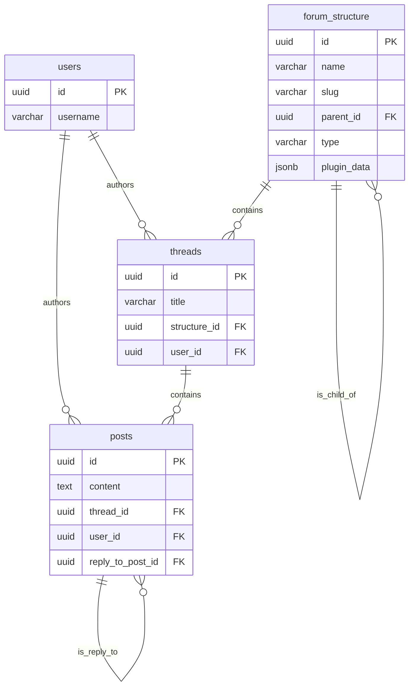

# Degentalk Forum: Technical Deep Dive & Contributor Guide

This document provides a comprehensive technical overview of the Degentalk forum system. It is intended for developers who are new to this part of the codebase and need to understand its architecture, data model, and development workflow.

## 1. Architecture

The forum system is a full-stack feature built with a modern, service-oriented architecture.

### 1.1. High-Level Diagram

```mermaid
graph TD
    subgraph Client (React/Vite)
        A[React Components] --> B{React Query Hooks};
        B --> C[forumApi.ts Service];
        C --> D[ForumStructureContext];
    end

    subgraph Server (Node.js/Express)
        E[API Routes] --> F[Controllers];
        F --> G[Services];
        G --> H[Drizzle ORM];
    end

    subgraph Database
        I[(PostgreSQL)]
    end

    subgraph Caching
        J[(Redis)]
    end

    subgraph Configuration
        K[forumMap.config.ts]
    end

    C -- API Calls --> E;
    G -- Queries --> H;
    H -- SQL --> I;
    G -- Cache --> J;
    G -- Reads Config --> K;
```

### 1.2. Core Philosophy: "Config-as-Truth"

A critical architectural principle is that the **forum hierarchy is defined in a version-controlled configuration file**, not directly in the database.

-   **Single Source of Truth:** `shared/config/forum-map.config.ts` defines the complete layout of featured forums, regular forums, and sub-forums, including their properties, themes, and rules.
-   **Synchronization:** A sync script (`pnpm db:sync:forums`) reads this configuration and populates the `forum_structure` table in the database. The `structure.service.ts` on the server contains the logic for this sync.
-   **Benefits:** This approach makes the forum structure auditable, version-controlled, and easy to replicate across different environments. It prevents ad-hoc changes directly in the database that can lead to inconsistencies.

## 2. Database Schema

The database schema is defined using Drizzle ORM in `db/schema/forum/`.

### 2.1. Entity-Relationship Diagram (ERD)



### 2.2. Key Tables

-   **`forum_structure`**:
    -   Stores the hierarchy of **forums** (both featured and regular forums).
    -   `type`: Can be `'forum'` (with `isFeatured` boolean to distinguish featured forums).
    -   `parent_id`: A self-referencing foreign key that creates the nested structure (e.g., a sub-forum's `parent_id` points to its parent forum).
    -   `plugin_data`: A flexible `jsonb` column used to store configuration that doesn't fit into a rigid column structure. **This is currently used to store permission rules.**

-   **`threads`**:
    -   Represents a single topic of discussion.
    -   `structure_id`: Foreign key to `forum_structure`, indicating which forum the thread belongs to.
    -   `user_id`: Foreign key to `users`, indicating the author.

-   **`posts`**:
    -   Represents a single message within a thread.
    -   `thread_id`: Foreign key to `threads`.
    -   `user_id`: Foreign key to `users`.
    -   `reply_to_post_id`: A self-referencing key to support nested replies.

## 3. Server-Side Implementation

The server-side logic is located in `server/src/domains/forum/` and follows a clean, service-oriented pattern.

### 3.1. Domain Structure

-   **`routes/`**: Defines the API endpoints using Express Router. It orchestrates the other modules.
-   **`controllers/`**: Handles the HTTP request/response cycle. It parses request parameters and calls the appropriate service methods.
-   **`services/`**: Contains the core business logic. This is where data is fetched, manipulated, and cached.
    -   `structure.service.ts`: Manages the forum hierarchy, including fetching the structure, calculating stats, and handling the `syncFromConfig` logic.
    -   `thread.service.ts`: Handles all operations related to threads, such as searching, fetching by slug/ID, and creating new threads. It includes caching and batching optimizations.
    -   `post.service.ts`: Handles all operations related to posts.
-   **`validation/`**: Contains Zod schemas for validating incoming API request bodies and parameters.

### 3.2. API Endpoints

The main API endpoints are defined in `server/src/domains/forum/routes/`. Here are some of the most important ones:

-   `GET /api/forum/structure`: Fetches the entire forum hierarchy.
-   `GET /api/forum/threads/search`: Searches for threads with various filters.
-   `GET /api/forum/threads/:id`: Fetches a single thread by its ID.
-   `POST /api/forum/threads`: Creates a new thread.
-   `GET /api/forum/threads/:threadId/posts`: Fetches the posts for a given thread.
-   `POST /api/forum/posts`: Creates a new post.

## 4. Client-Side Implementation

The client-side is a modern React application that uses React Query for data fetching and state management.

### 4.1. State Management

-   **React Query (`@tanstack/react-query`)**: Used for all server state management. It handles data fetching, caching, and synchronization with the backend. The query keys are typically the API endpoint URLs.
-   **`ForumStructureContext`**: This React context (`client/src/features/forum/contexts/ForumStructureContext.tsx`) fetches the entire forum structure once and provides it to the entire application. This avoids re-fetching the same data on every page. It has a fallback mechanism to use the static `forumMap.config.ts` if the API is unavailable.

### 4.2. Core Hooks

Custom hooks in `client/src/features/forum/hooks/` provide a clean and reusable way for components to interact with the forum data.

-   **`useForumQueries.ts`**:
    -   `useThreads(params)`: Fetches a paginated list of threads based on filter parameters.
    -   `useThread(slugOrId)`: Fetches a single thread.
    -   `usePosts(threadId)`: Fetches the posts for a specific thread.
-   **`useForumMutations.ts`**:
    -   `useCreateThread()`: Returns a mutation function for creating a new thread.
    -   `useCreatePost()`: Returns a mutation function for creating a new post.
    -   Handles `onSuccess` and `onError` callbacks for invalidating cache and showing toasts.

## 5. Developer Contribution Guide

### 5.1. Modifying the Forum Structure

**NEVER** modify the `forum_structure` table directly in the database.

1.  **Edit the Config File:** Open `shared/config/forum-map.config.ts`. Add, remove, or modify the forums in the `forumMap` object.
2.  **Run the Sync Script:** From the root of the project, run the following command:
    ```bash
    pnpm db:sync:forums
    ```
3.  **Verify:** The script will log the changes it's making (created, updated, archived). Start the application and verify your changes in the UI.

### 5.2. Adding a New API Endpoint

1.  **Service:** Add the business logic for your new feature to the appropriate service file in `server/src/domains/forum/services/`.
2.  **Controller:** Create a new controller function in `server/src/domains/forum/controllers/` that calls your service method.
3.  **Route:** Add a new route in the appropriate file in `server/src/domains/forum/routes/` that maps a URL to your controller function.
4.  **API Service (Client):** Add a new method to `client/src/features/forum/services/forumApi.ts` to call your new endpoint.
5.  **Hook (Client):** Create a new React Query hook in `useForumQueries.ts` or `useForumMutations.ts` that uses the new `forumApi` method.

### 5.3. Business Logic & Rules

-   **Permissions:** Forum access rules are defined in the `pluginData` property of the `forum_structure` table, which is populated from the `rules` property in `forumMap.config.ts`. Server-side checks in the services enforce these rules.
-   **MyBB Classic Theme:** The classic theme is a separate set of React components (e.g., `MyBBThreadList.tsx`) that are rendered conditionally based on user preference (stored in localStorage). This provides a good example of how to add alternative views.
-   **Admin Panel:** The admin panel for the forum is designed to be a safe UI for modifying the `forumMap.config.ts` file and triggering the sync script. This is the preferred way for non-developers to manage the forum structure.
