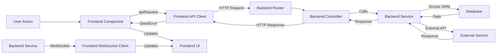
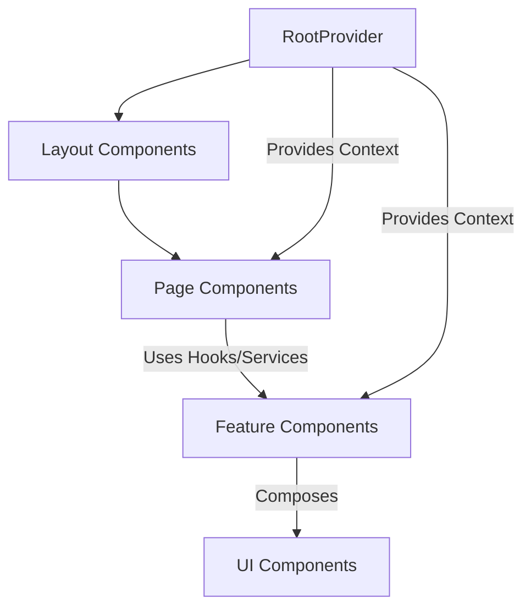

# Degentalk™™ System Patterns

## System Architecture

Degentalk™™ follows a **client-server architecture** with a PostgreSQL database.

*   **Client (Frontend):** A React application built with Vite, using React Query for server state, Context for global state, and wouter for routing. It is currently being restructured into a feature-based organization (`client/src/features/`).
*   **Server (Backend):** An Express.js application handling API requests, database interactions, and real-time communication via WebSockets. It is being migrated to a domain-driven structure (`server/src/domains/`).
*   **Database:** PostgreSQL, hosted on NeonDB, accessed via Drizzle ORM. Schema is defined through Drizzle migrations.
*   **Real-time:** WebSockets are used for features like the Shoutbox.
*   **External Services:** Integration with TronGrid API for blockchain interactions and planned integration with Stripe for payments.

```mermaid
graph LR
    User -- HTTP/WS --> Client[Frontend Application]
    Client -- HTTP API --> Server[Backend Application]
    Server -- SQL (Drizzle ORM) --> Database[PostgreSQL (NeonDB)]
    Server -- TronGrid API --> Blockchain[Tron Blockchain]
    Server -- Stripe API --> PaymentGateway[Stripe]
    Client -- WebSocket --> Server
```

## Key Technical Decisions

*   **Full-Stack TypeScript:** Ensures type safety across the entire application.
*   **Drizzle ORM:** Provides a type-safe and performant way to interact with the PostgreSQL database.
*   **NeonDB:** Chosen for its serverless architecture and scalability for PostgreSQL.
*   **React Query:** Manages server state efficiently on the frontend, handling caching, loading, and error states.
*   **Feature-Sliced Design (Client):** Organizes frontend code by feature domain for better maintainability and scalability.
*   **Domain-Driven Design (Server):** Organizes backend code by business domain, separating concerns into routes, controllers, services, etc.
*   **Standardized API Client (`apiRequest`):** Enforces consistent API interaction patterns on the frontend, including built-in XP gain detection.
*   **TronWeb Integration:** Direct interaction with the Tron blockchain for wallet and transaction features.
*   **Development Authentication Bypass:** A temporary decision to accelerate development by bypassing standard authentication in non-production environments.

## Design Patterns

*   **RESTful APIs:** Standard pattern for client-server communication.
*   **WebSocket Communication:** Used for real-time features (Shoutbox).
*   **Container/Presentational Components:** Separating logic and UI concerns, particularly in the frontend restructuring.
*   **React Context API:** Managing global state that needs to be accessed by multiple components without prop drilling.
*   **Repository Pattern (Emerging):** Abstracting database access logic (though some direct DB access still exists).
*   **Middleware:** Used on the server for cross-cutting concerns like authentication, validation, and error handling.
*   **Zod Validation:** Used for runtime data validation on both the frontend and backend.

## Data Flow

*   **User Interaction:** User action on the frontend triggers an API call via `apiRequest`.
*   **API Request:** `apiRequest` sends an HTTP request to the backend.
*   **Backend Routing:** Express.js routes the request to the appropriate domain controller.
*   **Controller Logic:** Controller handles request validation (using Zod), calls relevant service functions.
*   **Service Logic:** Service contains core business logic, interacts with the database (via Drizzle) or external services (TronGrid, Stripe).
*   **Database Interaction:** Drizzle ORM executes SQL queries against NeonDB.
*   **External Service Interaction:** Backend services communicate with TronGrid or Stripe APIs.
*   **Response:** Backend sends a response back to the frontend.
*   **Frontend State Update:** React Query updates cached data, triggering UI re-renders. Context or local state may also be updated.
*   **Real-time Updates:** Server may broadcast updates via WebSockets (e.g., new Shoutbox messages) which are received by the frontend and update UI.



## Component Relationships (Frontend - High Level)

*   **App/RootProvider:** Wraps the entire application, providing global contexts (Auth, Wallet, XP Toast, etc.) and setting up React Query.
*   **Layout Components:** Define the overall page structure (Header, Sidebar, main content area).
*   **Page Components:** Represent individual routes, fetching data (via hooks/services) and composing feature/UI components.
*   **Feature Components:** Encapsulate logic and UI for specific features (e.g., Wallet Modal, Shoutbox Widget, Forum Thread List), often using feature-specific hooks and services.
*   **UI Components:** Basic, reusable building blocks (Buttons, Inputs, Cards) often based on shadcn/ui primitives.



## Critical Implementation Paths

*   **User Authentication:** Registration -> Login -> Session Management -> Protected Route Access.
*   **Wallet Operations:** Wallet Creation -> Balance Display -> Deposit (Verification & Crediting) -> Withdrawal (Initiation & Processing) -> Transaction History.
*   **Forum Interaction:** Viewing Categories/Forums/Topics -> Viewing Threads -> Creating Threads -> Viewing Posts -> Creating Posts -> Liking Posts -> Marking Thread as Solved.
*   **XP/DGT Progression:** User Action (e.g., Post) -> XP Trigger -> XP Calculation (Backend) -> XP Update (Database) -> Level Check -> Level Up (Backend) -> XP/Level Display (Frontend) -> DGT Earning/Spending -> DGT Balance Update -> DGT Unlock Purchase.
*   **Admin Management:** Admin Login -> Dashboard Access -> User Management -> Treasury Management -> XP/DGT Settings Management.
